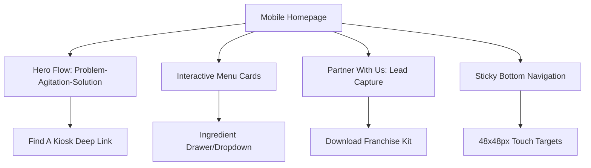

# Business Requirements Document (BRD)
## Project: Millet Sips Website Redesign

---

## 1. Document Control
* **Document Name:** Business Requirements Document (BRD) - Millet Sips Website Redesign
* **Author:** Project Strategy & Information Architecture Team
* **Status:** Draft
* **Date:** July 8, 2026
* **Target Audience:** Development Team, Marketing Stakeholders, Brand Leadership

---

## 2. Executive Summary & Brand Positioning
Millet Sips possesses a strong product-market fit but currently lacks an effective digital connection with its customers. The redesign shifts the website from a passive digital brochure to an active, customer-centric platform and modern health movement. 

### Core Objectives
1. **Prioritize the Consumer Journey:** Split the website pathways into consumer-facing (Menu, Store Locator) and investor-facing (Franchise Opportunities).
2. **Drive Immediate Conversion:** Simplify the "Zero-Moment-of-Truth" by placing store locator details front and center.
3. **Enhance Brand Narrative:** Move from mechanical product descriptions to lifestyle-driven benefits (e.g., "Reclaim your energy at 3 PM").

---

## 3. Problem Statement & Strategic Gaps
* **SPA Routing / SEO Issues:** The existing hash router (`/#/`) harms SEO indexing. The redesigned platform will use clean SEO URLs.
* **Information Clutter:** Confusing mix of B2C consumers looking for a drink and B2B investors looking for franchise data.
* **Low Conversion CTAs:** Lack of actionable items like locator tools, store maps, or high-intent conversion points.
* **Robotic Tone:** Descriptions focus on mechanical text instead of health benefits and customer stories.

---

## 4. User Journeys & Target Audiences
1. **The B2C Customer (On-the-go Office Worker):**
   * *Goal:* Find a physical kiosk or vending machine quickly, explore menu ingredients, and verify sugar-free/allergy options.
   * *Action:* Uses "Find a Kiosk" and interactive menus on a mobile device.
2. **The B2B Investor (Wellness/Franchise Partner):**
   * *Goal:* Download business/ROI model details and apply for franchise partnerships.
   * *Action:* Downloads Franchise Kit, fills out the partner form.

---

## 5. Functional Requirements (Mobile Wireframe Alignment)

Based on the mobile wireframe layout and strategy, the site must implement the following key features:

### 5.1 Hero Flow (Problem-Agitation-Solution)
* **Visual Presentation:** Prominent text placement highlighting the daily office drink challenge: *"Tired of unhealthy office drinks? Crave fresh, natural energy?"*
* **Solution Pitch:** *"Discover Millet Sips: Ancient Grains, Modern. Fresh. Zesty. Powered."*
* **CTA Button:** Deep-linked "FIND A KIOSK" button redirecting users to the nearest outlet based on their location.

### 5.2 Interactive Product Menu
* **Layout:** Thumbnail-sized product cards optimized for mobile viewports.
* **Product Details:**
  * High-resolution, appetizing product images.
  * Lifestyle benefit headlines (e.g., *Ragi Elaichi Chai: "Swap caffeine for sustained, jitter-free energy"*).
  * Expandable "INGREDIENTS ↓" drawer detailing full ingredients, calories, and nutritional profiles.

### 5.3 B2B Partner Lead Capture
* **Section:** "Partner With Us"
* **Header:** *"Join the Millet Revolution: Bring wellness to your city."*
* **Action Item:** Prominent, high-intent CTA button: *"DOWNLOAD FRANCHISE KIT"*.
* **Lead Conversion:** Triggers a modal form capturing: Name, Email, Phone, City, and Investment Budget before delivering the PDF download.

### 5.4 Sticky Bottom Navigation Bar
* **Implementation:** Always-visible footer bar on mobile screens.
* **Options:**
  1. **Find a Kiosk** (Geo-locator / Maps)
  2. **Our Menu** (Direct scroll/link to Product Grid)
  3. **Contact Us** (Quick contact options / Support form)
* **Accessibility:** Touch target minimum size of **48x48px** to guarantee seamless mobile interaction.

---

## 6. Technical & Non-Functional Requirements
* **SEO Optimized URLs:** Transition from hash-based routing (`/#/about`) to static SEO-friendly URLs (`/about`, `/menu`, `/locations`).
* **Performance:** Highly compressed images and lazy-loading of asset files to ensure load times under 2 seconds on mobile connections.
* **Security & Trust:** Integrated contact form replacing plain-text emails, alongside verified address mappings.
* **Content Freshness:** Standardized metadata showing accurate dates for recent articles.
